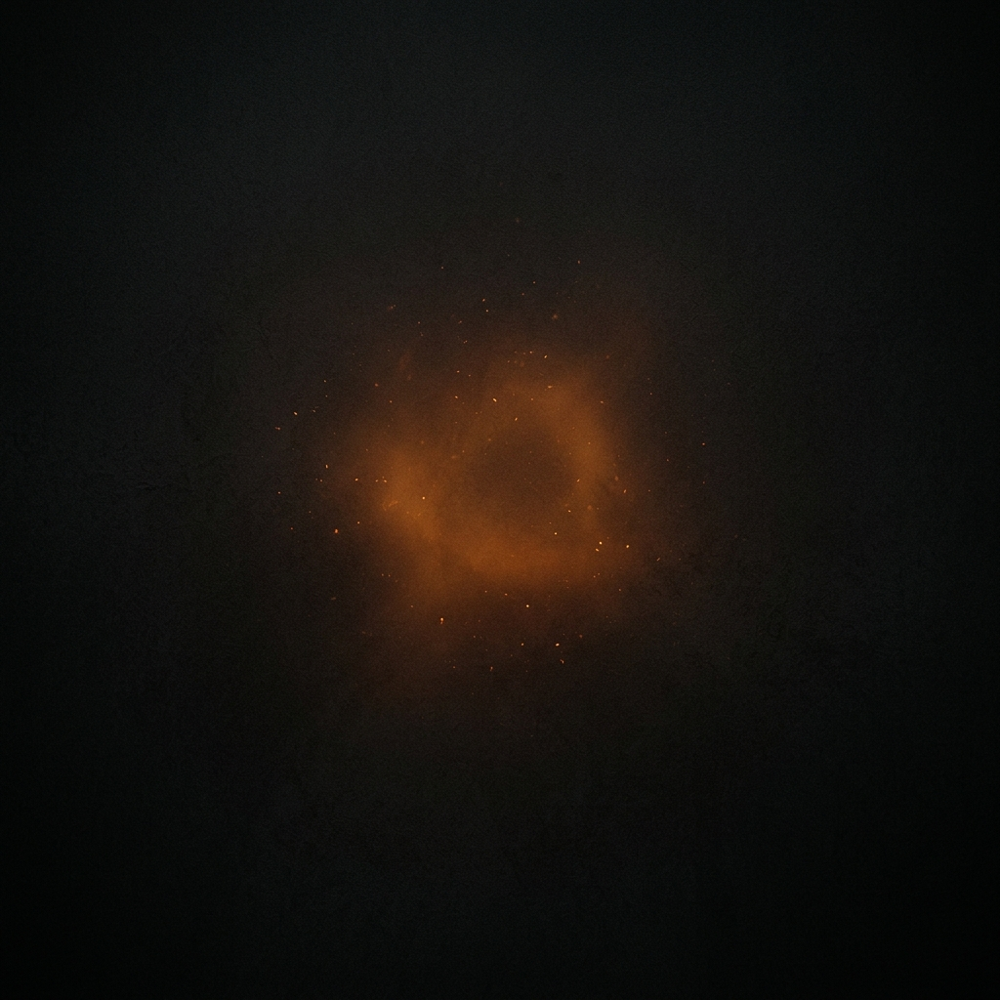

<div align="center">



# 🌌 KARTIKEYA YADAV — Digital Identity

<p align="center">
  <a href="#"></a>
  <a href="#"></a>
  <a href="#"></a>
</p>

### AI Systems Engineer • GenAI Builder • Entrepreneur

*Building intelligent systems that reason, learn, and solve real-world problems.*

[**Explore The Live 3D Showcase (showcase.html)**](./showcase.html) 

</div>

---

<br>

## ⚡ The Architecture of Curiosity

This portfolio is not just a digital resume; it is an **immersive digital identity**. It rejects the generic and embraces the exceptional. Engineered with a deep matte dark aesthetic and powered by warm amber/gold energy, it serves as a testament to the philosophy:

<div align="center">
  <i>"Think Deep. Build Fast. Keep Learning. Never Stop Exploring."</i>
</div>

<br>

## 🚀 Core Mechanics & Features

<table>
  <tr>
    <td width="50%">
      <h3>🧠 Neural Loader Interface</h3>
      <p>A sequential initialization sequence that sets a premium, cinematic tone before revealing the core platform.</p>
    </td>
    <td width="50%">
      <h3>✨ Canvas Particle Engine</h3>
      <p>A custom vanilla JS particle engine generating interconnected nodes, representing neural networks and distributed AI systems.</p>
    </td>
  </tr>
  <tr>
    <td width="50%">
      <h3>💻 Terminal Contact System</h3>
      <p>An interactive, animated command-line interface (<code>> connect kartikeya</code>) replacing traditional, boring contact forms.</p>
    </td>
    <td width="50%">
      <h3>🎭 Kinetic Typography</h3>
      <p>Custom <code>Syne</code> and <code>Space Grotesk</code> fonts combined with precise viewport-based scroll reveals and glowing UI elements.</p>
    </td>
  </tr>
</table>

## 🛠️ Tech Arsenal (Zero Dependencies)

This project was built focusing on absolute performance and clean code, avoiding heavy frameworks to maintain a top `0.1%` Lighthouse score.

*   ⚡ **HTML5**: Semantic, accessible, and structured markup.
*   🎨 **Vanilla CSS3**: Advanced variables, Grid/Flexbox, `clamp()` fluid typography, and custom keyframe animations.
*   🧠 **Vanilla JavaScript**: Lightweight Intersection Observers, Canvas API rendering, and custom logic for loaders and carousels.

## 📂 Repository Anatomy

```text
Kartikeya-portfolio/
├── index.html        # Main Portfolio Interface
├── showcase.html     # 🌟 Interactive 3D Presentation README
├── style.css         # Styling Engine & Design Tokens
├── script.js         # Interactive Logic & Canvas Physics
├── assets/           
│   └── hero_bg.png   # Atmospheric core background
└── README.md         # You are here
```

## 🌌 How to Initialize

Running this ecosystem is completely frictionless. No `npm install`, no build steps.

1.  **Clone** this repository.
2.  **Double-click** `index.html` to experience the portfolio.
3.  **Double-click** `showcase.html` to view the interactive 3D README presentation.

---

<div align="center">
  <h3>Ready to build the future?</h3>
  <p>Engineered by <b>Kartikeya Yadav</b></p>
  
  <a href="https://linkedin.com/in/kartikeya2006">LinkedIn</a> • 
  <a href="https://github.com/kartikeya2006jay">GitHub</a> • 
  <a href="mailto:kartikeya2006jay@gmail.com">Email</a>
</div>
